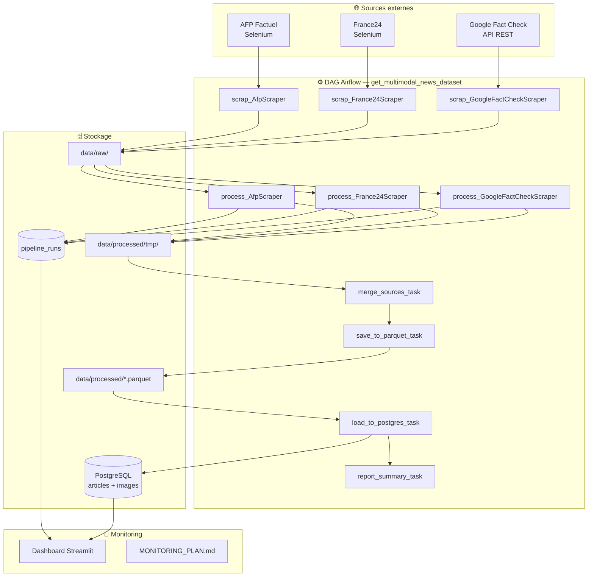
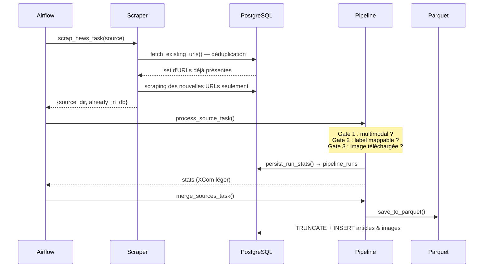
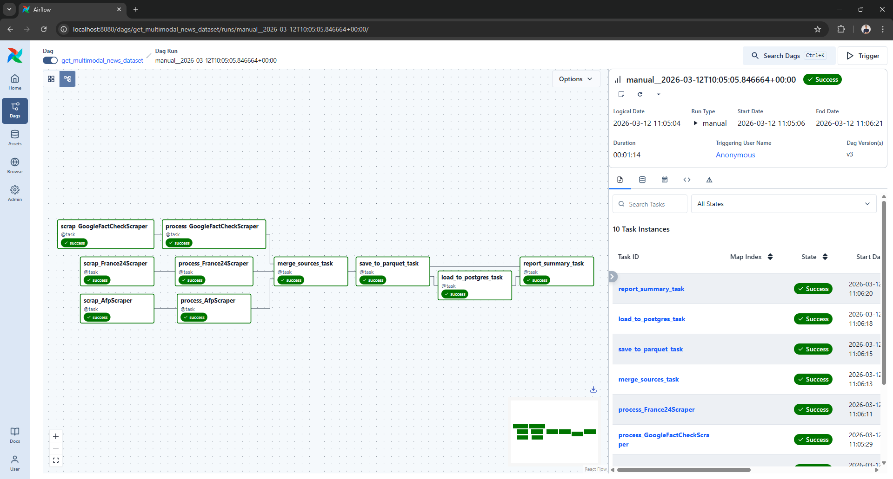
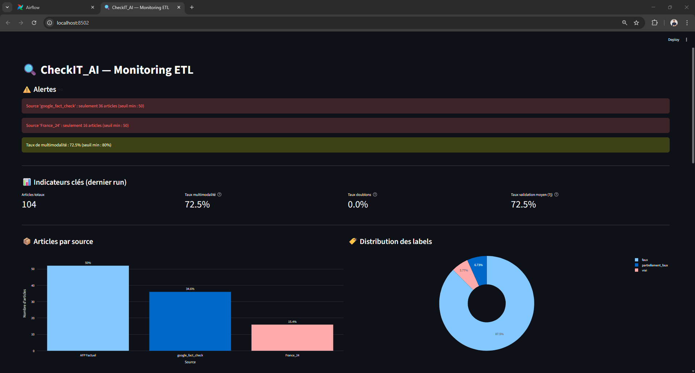

# 🔍 CheckIT_AI

[](https://www.python.org/)
[-017CEE.svg?logo=apacheairflow&logoColor=white)](https://airflow.apache.org/)
[](https://streamlit.io/)
[](https://www.postgresql.org/)
[](https://www.docker.com/)
[](https://www.selenium.dev/)

**Pipeline ETL automatisé pour la constitution d'un dataset multimodal de fact-checking.**  
CheckIT_AI extrait, nettoie et structure des articles de presse avec leurs images issues de sources de fact-checking (AFP, France24, Google Fact Check), puis les charge dans PostgreSQL pour entraîner un modèle de détection de désinformation.

---

## 🎯 Objectif

Constituer un dataset structuré **texte + image** annoté (vrai / faux / partiellement_faux) à partir de sources de fact-checking publiques. Chaque article doit être multimodal (texte + ≥1 image téléchargée) pour pouvoir alimenter un futur modèle de vision-langage.

---

## ✨ Fonctionnalités

✅ Scraping automatisé multi-sources avec Selenium et API REST  
✅ Déduplication en amont : les URLs déjà en base sont ignorées avant scraping  
✅ Pipeline de transformation avec 3 gates de validation (multimodalité, label, images)  
✅ Stockage intermédiaire sur disque (XCom-safe) pour les flux Airflow  
✅ Chargement Parquet + PostgreSQL avec TRUNCATE + append  
✅ Monitoring en temps quasi-réel via dashboard Streamlit  
✅ Alertes KPI automatiques avec seuils configurables  
✅ Historique des runs persisté dans `pipeline_runs`

---

## 📊 Architecture



---

## 🔄 Flux de données (séquence d'un run)





---

## 🗂️ Structure des fichiers

```
CHECKIT_AI/
│
├── 📂 dags/
│   └── extraction_dag.py         # DAG Airflow : orchestration complète du pipeline
│
├── 📂 src/
│   ├── 📂 extraction/
│   │   ├── 📂 core/
│   │   │   ├── base_scraper.py   # Classe abstraite + _fetch_existing_urls()
│   │   │   ├── selenium_scraper.py
│   │   │   └── api_client.py
│   │   └── 📂 scrapers/
│   │       ├── afp_scraper.py            # Scraper AFP (Selenium, 2 niveaux)
│   │       ├── france24_scraper.py       # Scraper France24 (Selenium)
│   │       ├── google_factcheck_client.py # Client API Google Fact Check
│   │       └── article_schema.py         # Schéma Pydantic de validation
│   │
│   ├── 📂 processing/
│   │   ├── pipeline.py           # Orchestration : transform → merge → parquet → persist
│   │   ├── cleaning.py           # Nettoyage texte HTML
│   │   ├── date_normalizer.py    # Normalisation dates → ISO 8601
│   │   ├── image_handler.py      # Téléchargement et validation des images
│   │   └── schema_transformer.py # Gates de validation + normalisation labels
│   │
│   └── 📂 monitoring/
│       ├── queries.py    # 7 requêtes SQL (articles + pipeline_runs)
│       ├── metrics.py    # MonitoringMetrics : compute_all() + check_alerts()
│       ├── config.py     # KPI_THRESHOLDS centralisés
│       └── dashboard.py  # Dashboard Streamlit (6 sections)
│
├── 📂 config/
│   ├── config.py         # Chemins, palette, MLflow URI
│   └── logger.py         # Logger structuré global
│
├── 📂 sql/
│   └── init_roles.sql.example  # Schéma SQL complet (rôles, tables, grants)
│
├── 📂 data/
│   ├── raw/{source}/data.json   # Données brutes par source
│   └── processed/
│       ├── articles.parquet
│       ├── images.parquet
│       └── tmp/                 # Fichiers intermédiaires par source
│
├── docker-compose.override.yml  # Selenium Chrome + montages src/ et config/
├── Dockerfile                   # Image Astro Runtime personnalisée
├── pyproject.toml               # Dépendances projet (Python 3.13+)
├── schema_conceptuel.md         # MCD : modèle de données ARTICLE ↔ IMAGE
└── MONITORING_PLAN.md           # Stratégie de surveillance du pipeline
```

---

## 🧠 Logique du pipeline

### 1. Extraction (src/extraction/)

Chaque scraper hérite de `BaseScraper` (ou `APIClient`). Avant de scraper, `_fetch_existing_urls()` interroge la table `articles` pour récupérer les URLs déjà présentes — les doublons sont écartés en amont, ce qui économise du temps et de la bande passante.

- **AFP / France24** : navigation Selenium en 2 niveaux (listing → article), parsing BeautifulSoup
- **GoogleFactCheck** : appels à l'API publique Google par mots-clés, pas de Selenium

### 2. Transformation (src/processing/pipeline.py)

Chaque article brut passe par 3 gates séquentielles dans `_transform_one_article()` :

| Gate | Condition | Rejet si |
|------|-----------|----------|
| 1 — Multimodalité | Article avec texte ET au moins 1 image | `skipped_not_multimodal` |
| 2 — Label | Label mappable vers `vrai/faux/partiellement_faux` | `skipped_bad_label` |
| 3 — Image | ≥1 image effectivement téléchargée sur disque | `skipped_no_image` |

Les stats par gate sont persistées dans `pipeline_runs` après chaque source, alimentant le monitoring.

**Stratégie XCom** : les données brutes (potentiellement volumineuses) sont écrites sur disque (`data/processed/tmp/`). Seules les stats légères transitent via XCom Airflow, évitant la limite de ~48 KB par défaut.

### 3. Monitoring (src/monitoring/)

`MonitoringMetrics.compute_all()` charge les 7 KPIs depuis la base, puis `check_alerts()` les compare aux seuils définis dans `config.py`. Le dashboard Streamlit se rafraîchit toutes les 5 minutes. Voir [MONITORING_PLAN.md](MONITORING_PLAN.md) pour la stratégie complète.

### 4. Modèle de données

Voir [schema_conceptuel.md](schema_conceptuel.md) pour le MCD complet (tables `articles` et `images`, justification de la modélisation 1:N, format d'export pour l'IA).

---

## 🚀 Installation

### Prérequis

- Python 3.13+
- Docker Desktop
- [Astro CLI](https://docs.astronomer.io/astro/cli/install-cli) (`astro`)

### Installation locale

```bash
# Cloner le projet
git clone https://github.com/RandomFab/CHECKIT_AI.git
cd CHECKIT_AI

# Environnement virtuel
python -m venv .venv
.venv\Scripts\activate       # Windows
# source .venv/bin/activate  # Linux/Mac

# Dépendances
pip install -r requirements.txt
pip install -e .
```

### Configuration `.env`

```env
DB_HOST=localhost
DB_PORT=5432
DB_NAME=checkit
DB_WRITER_USER=writer
DB_WRITER_PASSWORD=<password>
DB_READER_USER=reader
DB_READER_PASSWORD=<password>
GOOGLE_FACTCHECK_API_KEY=<api_key>
```

### Initialiser la base PostgreSQL

```bash
psql -U postgres -f sql/init_roles.sql
```

---

## 🐳 Lancer avec Astro (Airflow + Docker)

```bash
# Démarrer l'environnement Airflow + Selenium
astro dev start

# Redémarrer après modification
astro dev restart
```

- **Airflow UI** : [http://localhost:8080](http://localhost:8080)
- **Selenium noVNC** (debug visuel) : [http://localhost:7900](http://localhost:7900) — mot de passe : `secret`

---

## 📡 Dashboard Monitoring

```bash
streamlit run src/monitoring/dashboard.py
```

6 sections : alertes actives, KPI cards, volumes par source, distribution des labels, taux de validation sur 7j, entonnoir de validation du dernier run.



---

## 👤 Auteur

RandomFab - Fabien BARDOUIL
