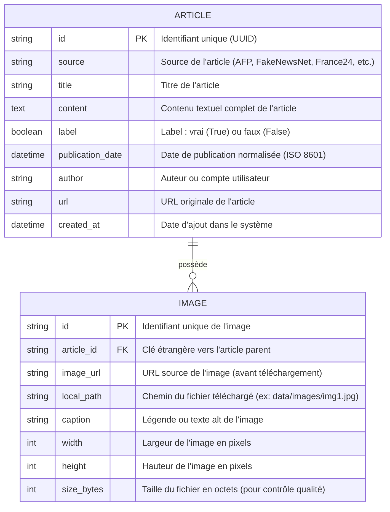

# Schéma Conceptuel des Données (MCD)
## CheckIt.AI - Pipeline Multimodal

### 1. Diagramme Conceptuel



---

### 2. Description de la Structure

#### Table ARTICLE
| Champ | Type | Description | Contrainte |
|-------|------|-------------|-----------|
| `id` | UUID | Identifiant unique de l'article | PRIMARY KEY, NOT NULL |
| `source` | String | Source de provenance (AFP, Twitter, Reddit, etc.) | NOT NULL |
| `title` | String | Titre de l'article | NOT NULL |
| `content` | Text | Contenu textuel complet (nettoyé du HTML) | NOT NULL |
| `label` | Boolean | Vraie information (True) ou désinformation (False) | NOT NULL |
| `publication_date` | DateTime | Date de publication normalisée en UTC/ISO 8601 | NOT NULL |
| `author` | String | Auteur, compte ou média source | NULLABLE |
| `url` | String | URL originale de la source | NULLABLE |
| `created_at` | DateTime | Timestamp d'ajout au système | NOT NULL, DEFAULT=NOW() |

#### Table IMAGE
| Champ | Type | Description | Contrainte |
|-------|------|-------------|-----------|
| `id` | UUID | Identifiant unique de l'image | PRIMARY KEY, NOT NULL |
| `article_id` | UUID | Référence à l'article parent | FOREIGN KEY → ARTICLE.id, NOT NULL |
| `image_url` | String | URL source avant téléchargement | NULLABLE |
| `local_path` | String | Chemin dans le système de fichiers | NOT NULL |
| `caption` | String | Légende ou texte alt (important pour le multimodal) | NULLABLE |
| `width` | Int | Largeur en pixels | NULLABLE |
| `height` | Int | Hauteur en pixels | NULLABLE |
| `size_bytes` | Int | Taille du fichier en octets | NULLABLE |

---

### 3. Justification de la Modélisation

#### Pourquoi deux tables ?

1. **Flexibilité :** Un article peut avoir 0, 1 ou N images. Deux tables permettent de gérer tous ces cas sans redondance.
2. **Normalisation :** Respecte les principes ACID et évite la duplication de données.
3. **Scalabilité :** Si un article a 10 images, on ne duplique pas le texte 10 fois.

#### Relation 1:N

- **Un Article** peut avoir **plusieurs Images** (1:N)
- **Une Image** appartient à **un seul Article**
- La clé étrangère `article_id` dans IMAGE garantit l'intégrité référentielle

#### Champs clés pour le cas d'usage IA

- **`caption`** (Image) : Souvent négligé mais critique. Un fake news peut être une image vraie avec une fausse légende !
- **`local_path`** (Image) : Les modèles de vision doivent lire depuis le disque, pas charger depuis internet.
- **`publication_date`** (Article) : Normalisée en ISO 8601 pour éviter les bugs de parsing temporel.
- **`source`** (Article) : Permet de tracer et d'analyser par source (utile pour déterminer si une source est fiable).

---

### 4. Format d'Exportation pour l'IA

Bien que stockées en deux tables en base, pour l'entraînement du modèle d'IA multimodal, les données seront reconstituées en JSON dénormalisé :

```json
{
  "id": "article_123",
  "source": "AFP",
  "title": "Titre de l'article",
  "content": "Contenu de l'article...",
  "label": true,
  "publication_date": "2026-03-02T10:30:00Z",
  "author": "Journaliste",
  "url": "https://exemplo.com/article",
  "images": [
    {
      "id": "img_001",
      "image_url": "https://...",
      "local_path": "data/images/img_001.jpg",
      "caption": "Légende de l'image",
      "width": 1920,
      "height": 1080
    },
    {
      "id": "img_002",
      "image_url": "https://...",
      "local_path": "data/images/img_002.jpg",
      "caption": "Deuxième image",
      "width": 1920,
      "height": 1080
    }
  ]
}
```
